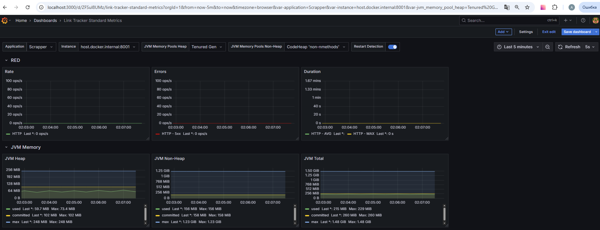
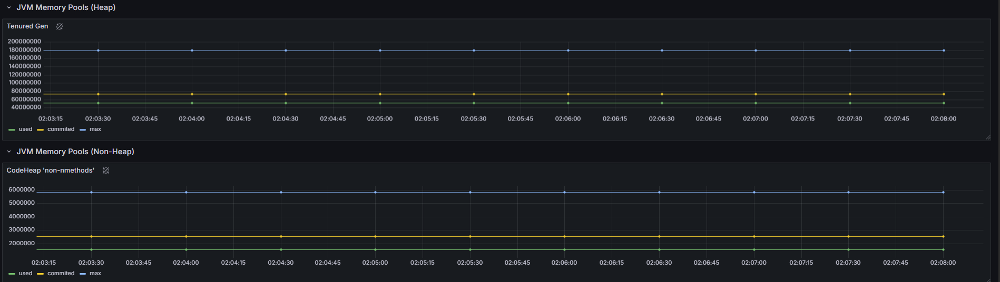
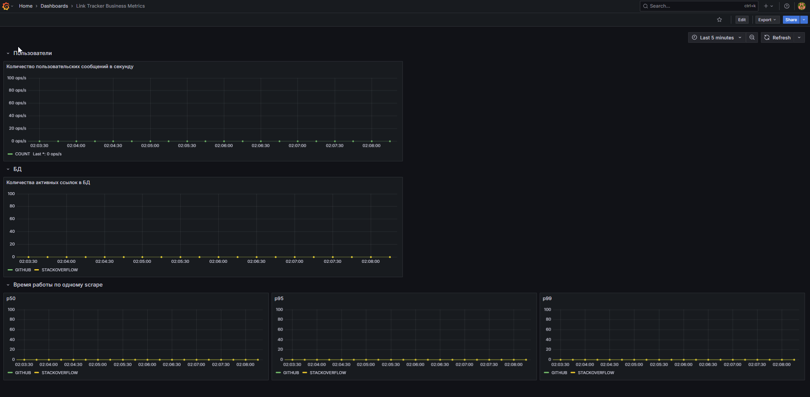
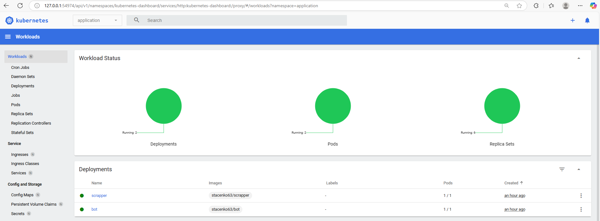
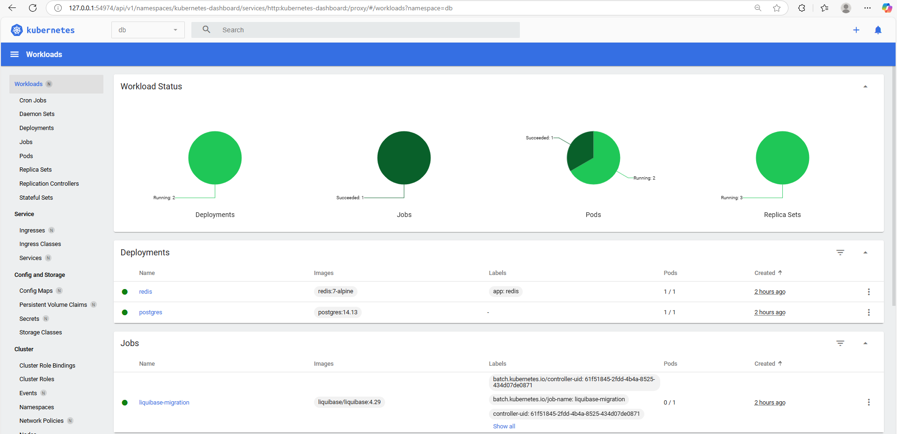
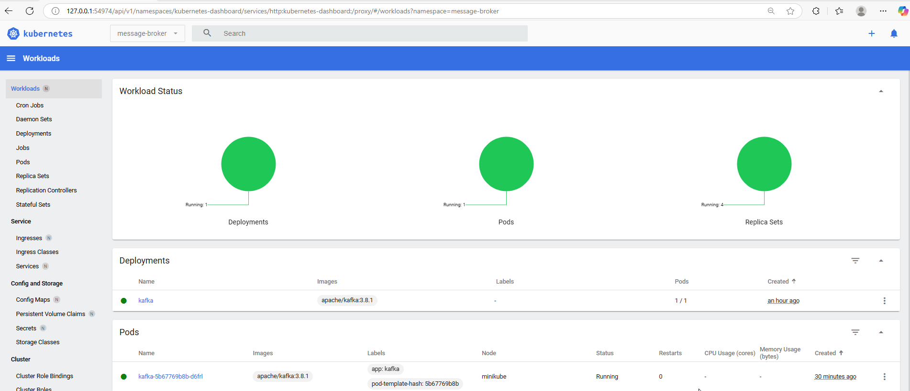
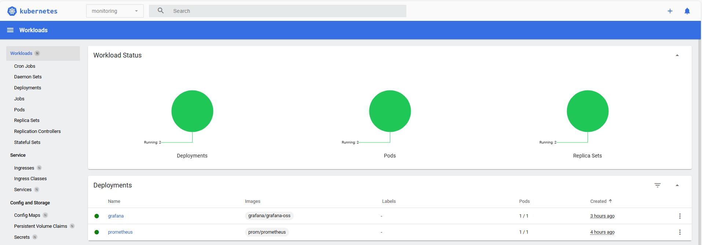

# Академия бэкенда от Т-Банка 2025, 2 семестр, Проект: LinkTracker: приложение для отслеживания обновлений контента

## Описание
Проект представляет собой реализацию сервиса LinkTracker для отслеживания обновлений на веб-ресурсах. Основной функционал включает подписку на изменения контента по URL-адресам, мониторинг обновлений и отправку уведомлений пользователям через Telegram-бота.

Система позволяет:

* Добавлять и удалять отслеживаемые ссылки через чат-бота
* Автоматически проверять обновления на подписанных страницах
* Получать уведомления о новых ответах, комментариях и изменениях контента
* Управлять подписками с помощью тегов и фильтров

## Функциональные требования
* Бот должен поддерживать следующие команды:
   * /start - регистрация пользователя.
   * /help - вывод списка доступных команд.
   * /track - начать отслеживание ссылки.
   * /untrack - прекратить отслеживание ссылки.
   * /list - показать список отслеживаемых ссылок (cписок ссылок, полученных при /track)
* Команда /list должна выводить специальное сообщение, если список отслеживаемых ссылок пуст.
* Неизвестные команды должны игнорироваться с уведомлением пользователю.
* При попытке добавить ссылку, которая уже отслеживается, выводится сообщение: "Ссылка уже отслеживается"
* Все endpoint'ы соответствуют OpenAPI-контракту
   * Разрешено модифицировать LinkUpdate в Bot API для расширения и добавления новой информации (для упрощения форматирования)
   * Ссылка на контракт OpenAPI: https://gist.github.com/sanyarnd/e35dc3d4e0c8000205ec5029dac38f5a (2 файла)
* Реализован планировщик: бот присылает уведомление в случае обнаружения изменений
* Общение между приложениями bot и scrapper происходит по HTTP или Apache Kafka
* Бот должен регистировать доступные команды через метод setmycommands при запуске
* Scrapper (планировщик) при отправке сообщения с изменениями включает детализацию данных:
   * Для StackOverflow новый ответ или комментарий, сообщение включает:
      * текст темы вопроса
      * имя пользователя
      * время создания
      * превью ответа или комментария (первые 200 символов)
   * Для GitHub новый PR или Issue, сообщение включает:
      * название PR или Issue
      * имя пользователя
      * время создания
      * превью описания (первые 200 символов)
* Планировщик должен работать многопоточно
* Возможность тэгирования ссылок: создание тэгов по темам или проектам позволит группировать подписки. Например, можно создать тэг "Работа", в который войдут ссылки на профессиональные ресурсы, и тэг "Хобби" для развлечений. Соответственно должны появиться операции управления тэгами.
* Некорректные (не парсится и т.п.) сообщения отправляются в отдельную очередь dead letter queue
* Все имена топиков задаются в конфигурационном файле 
* Бот кэширует запросы типа `/list` в Redis
* Функционал фильтрации: реализовать возможность не получать уведомления от определенных пользователей
* Батчинг уведомлений: реализовать отправку уведомлений не сразу при обнаружении, а по настраиваемому расписанию, например, утром в 10:00 единым сообщением (дайджест)
   * Время отправки должно быть конфигурируемым
   * Должна быть возможность выбрать режим уведомлений в настройках бота: "сразу" или "дайджест раз в сутки"
   * Для накопления состояния следует использовать Redis
* Все HTTP-запросы поддерживают Timeout
* Все HTTP-запросы поддерживают Retry
* У каждого публичного endpoint'а есть выставленный Rate Limiting на основе IP-адреса клиента
* В случае недоступности сервиса продолжительное время вместо Retry соединение разрывается при помощи Circuit Breaker
* В случае отказа HTTP или Kafka при отправке уведомлений происходит fallback на альтернативный транспорт
* В приложении доступен эндпоинт `/metrics` на выделенном порте (порт основного приложения != порт `/metrics`)
* compose-файл содержит настроенные сервисы `prom/prometheus` и `grafana/grafana-oss`
* Создан параметризованный (`Dashboard Settings -> Variables`) дашборд на основе стандартных метрик, параметризация сделана по имени приложения:
   * RED-метрики
   * количество используемой памяти в единицу времени с разбивкой по типу (если применимо)
   * в PR прикреплены pql-запросы и скриншот
* Создан дашборд на основе кастомных бизнес-метрик:
   * Количество пользовательских сообщений в секунду
   * График количества активных ссылок в БД по типу (github, stackoverflow)
   * p50, p95, p99 времени работы одного scrape по типу (github, stackoverflow)
* В проекте присутствуют `bot.Dockerfile` и `scrapper.Dockerfile`, которые собирают приложение в образ, сборка включена в CI/CD

## Нефункциональные требования
* Проект должен быть написан на `Java 23` с использованием `Spring Boot 3`.
* Токен авторизации должен храниться в конфигурационном файле, недоступном для общего доступа 
* Запрещено подключать дополнительные библиотеки в шаблон
* Поддерживается скреппинг вопросов StackOverflow и репозиториев GitHub
* Не нужно парсить страницу (HTML), нужно работать с API: GitHub, StackOverflow
* Запрещается использовать готовые SDK для доступа к API для HTTP-клиентов (GitHub, StackOverflow)
   * Клиентов нужно написать руками
   * По возможности используйте декларативные клиенты
* Бот должен реализовывать концепт машины состояний (создание /track должно идти в формате диалога, а не команды):
   * неверно: /track tag=work tag=hobby https://foo.bar/baz
   * верно:
      * > /track https://foo.bar/baz (можно раздельно /track и отдельно ссылка)
      * < введите тэги (опционально)
      * > work hobby
      * < настройте фильтры (опционально)
      * > user:dummy type:comment
* В тестах запрещено делать реальные вызовы к API внешних систем, нужно использовать заглушки (mocks)
* Используйте типобезопасную конфигурацию
* Используйте структурное логирование (добавление key-value значений к логу, вместо зашивания данных в поле message) в коде приложения
* При проверке обновлений запрещено загружать все ссылки в память сразу
* Логика планировщика (проверка ссылок) и отправки (уведомления) разнесены по разным сервисам 
   * Объявлен интерфейс для сервиса отправки уведомлений scrapper -> bot
   * Пока что будет одна реализация -- HTTP (в следующем ДЗ появится Kafka)
* Запуск Postgres осуществляется
   * через compose-файл для локальной разработки
   * через testcontainers для автоматического тестирования
* Миграции должны быть написаны на языке SQL
* Для миграций используется Liquibase 
* Схема БД должна находиться в каталоге migrations/ в корне проекта
* Запуск миграций должен выполняться собственноручно написанной функцией
* Реализуйте 2 способа работы с БД: "голый" SQL и ORM. Например, у вас есть LinkService, тогда у него будет 2 имплементации: OrmLinkService и SqlLinkService. 
* Выбор способа работы с БД осуществляется через конфигурацию: access-type=SQL или access-type=ORM
* Выбор транспорта происходит в конфигурационном файле при помощи свойства `app.message-transport: {Kafka, HTTP}`
* Отправка уведомлений реализована как абстракция (сервис)
* Уведомления в Kafka передаются в формате JSON 
* Бот делает инвалидацию кэша, если пользователь сделал изменение в списке своих отслеживаемых ссылок (добавил, удалил, изменил)
* Параметры Timeout настраиваются в конфигурации
* Параметры Rate Limiting настраиваются в конфигурации
* Политика Retry задаётся в конфигурации и позволяет задать количество повторов и время между попытками (constant backoff)
* Retry происходит только в случае если это имеет смысл: вам нужен настраиваемый список кодов, на которые происходит retry
* Параметры Circuit Breaker настраиваются в конфигурации
* Circuit Breaker настроен в режиме скользящего окна

## Стандартные метрики

Файл для импорта дашборда со стандартными метриками (также содержит все pql запросы):  [link-tracker-standard-metrics.json](files/link-tracker-standard-metrics.json)

## Бизнес метрики

Файл для импорта дашборда с бизнес метриками (также содержит все pql запросы):
[link-tracker-business-metrics.json](files/link-tracker-business-metrics.json)

## Публикация в k8s кластер:
### Bot и Scrapper в пространстве имен application

### Postgres, Redis и Liquebase Migration в пространстве имен db

### Kafka в пространстве имен message-broker

### Prometheus и Grafana в пространстве имен monitoring

## Справочная информация
* [Запуск и использование](./docs/2.%20Разработка/setup-dev-env.md)
* [Архитектура](./docs/1.%20Архитектура/high-level-design.md)
* [Шаблон проекта](./HELP.md)
* Диаграммы:
   * [/help](./docs/1.%20Архитектура/diagrams/help-command.md)
   * [/list](./docs/1.%20Архитектура/diagrams/list-command.md)
   * [/notificationmode](./docs/1.%20Архитектура/diagrams/notification-mode-command.md)
   * [/track](./docs/1.%20Архитектура/diagrams/track-command.md)
