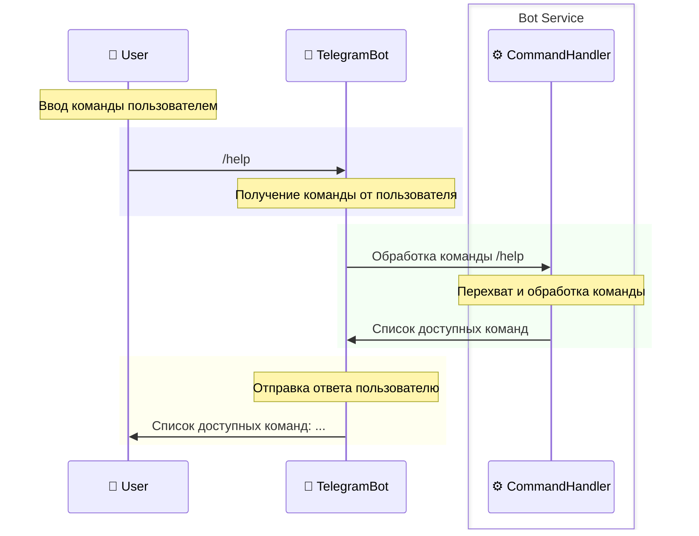

```mermaid
sequenceDiagram
    participant User as 👤 User
    participant TelegramBot as 🤖 TelegramBot

    box Bot Service
        participant CommandHandler as ⚙️ CommandHandler
    end

    Note over User: Ввод команды пользователем

    rect rgba(180, 180, 255, 0.2)
        User->>TelegramBot: /help
        Note over TelegramBot: Получение команды от пользователя
    end

    rect rgba(200, 255, 200, 0.2)
        TelegramBot->>CommandHandler: Обработка команды /help
        Note over CommandHandler: Перехват и обработка команды
        CommandHandler->>TelegramBot: Список доступных команд
    end

    rect rgba(255, 255, 180, 0.2)
        Note over TelegramBot: Отправка ответа пользователю
        TelegramBot->>User: Список доступных команд: ...
    end
```
