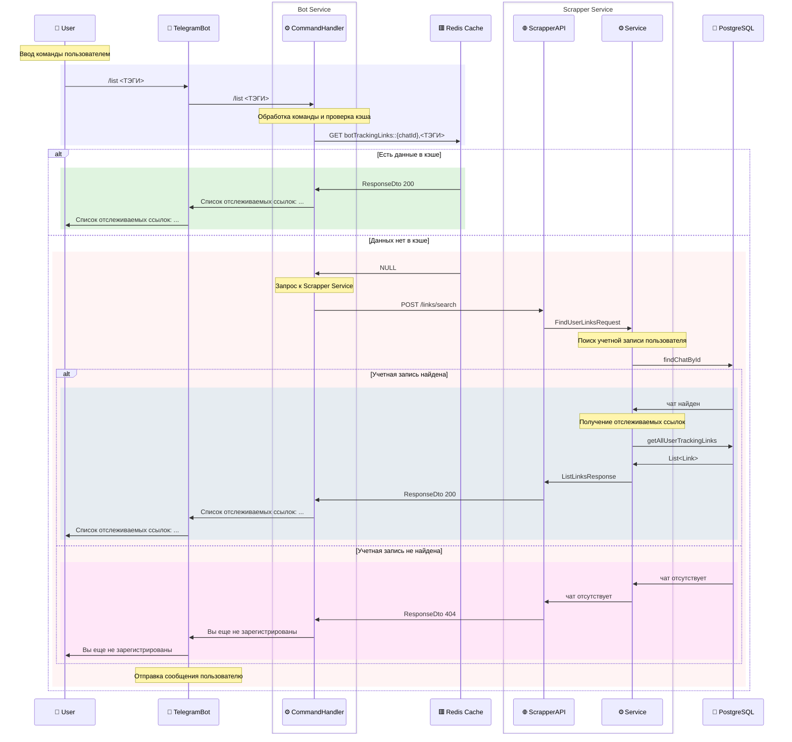

```mermaid
sequenceDiagram
    participant User as 👤 User
    participant TelegramBot as 🤖 TelegramBot

    box Bot Service
        participant CommandHandler as ⚙️ CommandHandler
    end

    participant Redis as 🟥 Redis Cache

    box Scrapper Service
        participant ScrapperAPI as 🌐 ScrapperAPI
        participant Service as ⚙️ Service
    end

    participant PostgreSQL as 🐘 PostgreSQL

    Note over User: Ввод команды пользователем

    rect rgba(180, 180, 255, 0.2)
        User->>TelegramBot: /list <ТЭГИ>
        TelegramBot->>CommandHandler: /list <ТЭГИ>
        Note over CommandHandler: Обработка команды и проверка кэша
        CommandHandler->>Redis: GET botTrackingLinks::{chatId},<ТЭГИ>
    end

    alt Есть данные в кэше
        rect rgba(100, 200, 100, 0.2)
            Redis->>CommandHandler: ResponseDto 200
            CommandHandler->>TelegramBot: Список отслеживаемых ссылок: ...
            TelegramBot->>User: Список отслеживаемых ссылок: ...
        end
    else Данных нет в кэше
        rect rgba(255, 200, 200, 0.2)
            Redis->>CommandHandler: NULL
            Note over CommandHandler: Запрос к Scrapper Service
            CommandHandler->>ScrapperAPI: POST /links/search
            ScrapperAPI->>Service: FindUserLinksRequest

            Note over Service: Поиск учетной записи пользователя
            Service->>PostgreSQL: findChatById

            alt Учетная запись найдена
                rect rgba(173, 216, 230, 0.3)
                    PostgreSQL->>Service: чат найден
                    Note over Service: Получение отслеживаемых ссылок
                    Service->>PostgreSQL: getAllUserTrackingLinks
                    PostgreSQL->>Service: List<Link>
                    Service->>ScrapperAPI: ListLinksResponse
                    ScrapperAPI->>CommandHandler: ResponseDto 200
                    CommandHandler->>TelegramBot: Список отслеживаемых ссылок: ...
                    TelegramBot->>User: Список отслеживаемых ссылок: ...
                end
            else Учетная запись не найдена
                rect rgba(255, 200, 255, 0.3)
                    PostgreSQL->>Service: чат отсутствует
                    Service->>ScrapperAPI: чат отсутствует
                    ScrapperAPI->>CommandHandler: ResponseDto 404
                    CommandHandler->>TelegramBot: Вы еще не зарегистрированы
                    TelegramBot->>User: Вы еще не зарегистрированы
                end
            end

            Note over TelegramBot: Отправка сообщения пользователю
        end
    end
%%sequenceDiagram
%%    participant User as 👤 User
%%    participant TelegramBot as 🤖 TelegramBot
%%
%%    box Bot Service
%%        participant CommandHandler as ⚙️ CommandHandler
%%    end
%%
%%    participant Redis as 🟥 Redis Cache
%%
%%    box Scrapper Service
%%        participant ScrapperAPI as 🌐 ScrapperAPI
%%        participant Service as ⚙️ Service
%%    end
%%
%%    participant PostgreSQL as 🐘 PostgreSQL
%%
%%    Note over User: Ввод команды пользователем
%%
%%    User->>TelegramBot: /list <ТЭГИ>
%%    Note over CommandHandler: Перехват команды обработчиком
%%    TelegramBot->>CommandHandler: /list <ТЭГИ>
%%    Note over CommandHandler: Проверка наличия данных в кэше
%%    CommandHandler->>Redis: GET botTrackingLinks::{chatId},<ТЭГИ>
%%
%%    alt Есть данные в кэше
%%        rect rgba(100, 200, 100, 0.2)
%%            Redis->>CommandHandler: ResponseDto 200
%%            CommandHandler->>TelegramBot: Список отслеживаемых ссылок: ...
%%            TelegramBot->>User: Список отслеживаемых ссылок: ...
%%        end
%%    else Данных нет в кэше
%%        rect rgba(200, 100, 100, 0.2)
%%            Redis->>CommandHandler: NULL
%%            CommandHandler->>ScrapperAPI: POST /links/search
%%            ScrapperAPI->>Service: FindUserLinksRequest
%%            Note over Service: Поиск учетной записи
%%            Service->>PostgreSQL: findChatById
%%            
%%            alt У пользователя есть учетная запись
%%                rect rgba(173, 216, 230, 0.3)
%%                    PostgreSQL->>Service: чат найден
%%                    Note over Service: Поиск отслеживаемых ссылок пользователя
%%                    Service->>PostgreSQL: getAllUserTrackingLinks
%%                    PostgreSQL->>Service: List<Link>
%%                    Service->>ScrapperAPI: ListLinksResponse
%%                    ScrapperAPI->>CommandHandler: ResponseDto 200
%%                    CommandHandler->>TelegramBot: Список отслеживаемых ссылок: ...
%%                    TelegramBot->>User: Список отслеживаемых ссылок: ...
%%                end
%%            else У пользователя нет учетной записи
%%                rect rgba(200, 100, 200, 0.2)
%%                    PostgreSQL->>Service: чат отсутствует
%%                    Service->>ScrapperAPI: чат отсутствует
%%                    ScrapperAPI->>CommandHandler: ResponseDto 404
%%                    CommandHandler->>TelegramBot: Вы еще не зарегистрированы
%%                    TelegramBot->>User: Вы еще не зарегистрированы
%%                end
%%            end
%%
%%            Note over TelegramBot: Отправка сообщения пользователю
%%        end
%%    end
```
