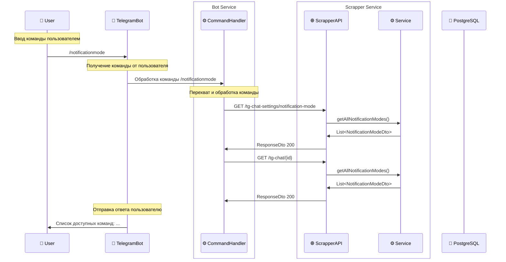

```mermaid
sequenceDiagram
    participant User as 👤 User
    participant TelegramBot as 🤖 TelegramBot

    box Bot Service
        participant CommandHandler as ⚙️ CommandHandler
    end

    box Scrapper Service
        participant ScrapperAPI as 🌐 ScrapperAPI
        participant Service as ⚙️ Service
    end

    participant PostgreSQL as 🐘 PostgreSQL

    Note over User: Ввод команды пользователем

    User->>TelegramBot: /notificationmode
    Note over TelegramBot: Получение команды от пользователя

    TelegramBot->>CommandHandler: Обработка команды /notificationmode
    Note over CommandHandler: Перехват и обработка команды
    
    CommandHandler->>ScrapperAPI: GET /tg-chat-settings/notification-mode
    ScrapperAPI->>Service: getAllNotificationModes()
    Service->>ScrapperAPI: List<NotificationModeDto>
    ScrapperAPI->>CommandHandler: ResponseDto 200

    CommandHandler->>ScrapperAPI: GET /tg-chat/{id}
    ScrapperAPI->>Service: getAllNotificationModes()
    Service->>ScrapperAPI: List<NotificationModeDto>
    ScrapperAPI->>CommandHandler: ResponseDto 200

    Note over TelegramBot: Отправка ответа пользователю
    TelegramBot->>User: Список доступных команд: ... 
```
