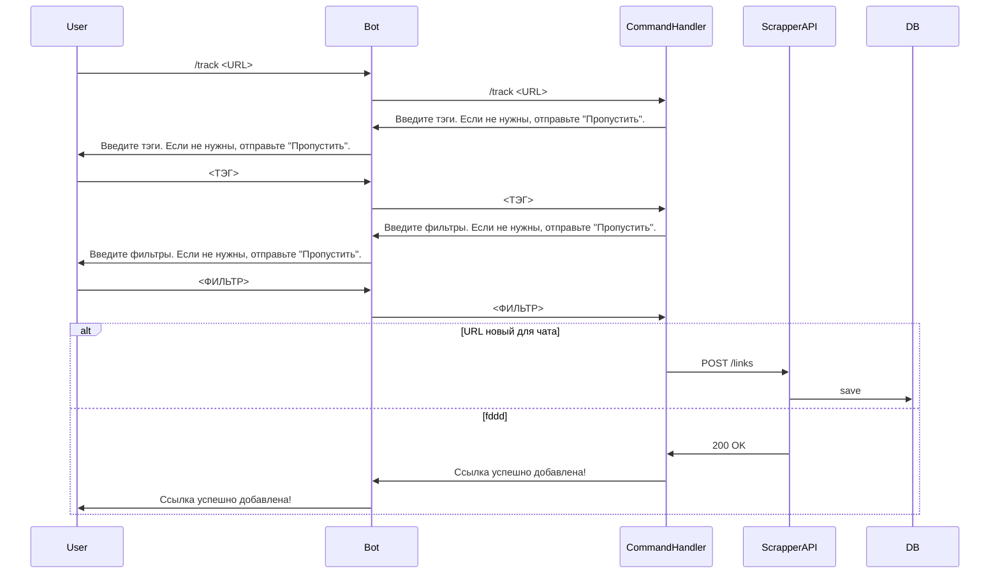

```mermaid
sequenceDiagram
participant User
participant Bot
participant CommandHandler
participant ScrapperAPI
participant DB 

    User->>Bot: /track <URL>
    Bot->>CommandHandler: /track <URL>
    CommandHandler->>Bot: Введите тэги. Если не нужны, отправьте "Пропустить".
    Bot->>User: Введите тэги. Если не нужны, отправьте "Пропустить".
    
    
    User->>Bot: <ТЭГ>
    Bot->>CommandHandler: <ТЭГ>
    CommandHandler->>Bot: Введите фильтры. Если не нужны, отправьте "Пропустить".
    Bot->>User: Введите фильтры. Если не нужны, отправьте "Пропустить".
    User->>Bot: <ФИЛЬТР>
    Bot->>CommandHandler: <ФИЛЬТР>
    
    alt URL новый для чата
        CommandHandler->>ScrapperAPI: POST /links
        ScrapperAPI->>DB: save

    else fddd
        ScrapperAPI->>CommandHandler: 200 OK
        CommandHandler->>Bot: Ссылка успешно добавлена!
        Bot->>User: Ссылка успешно добавлена!
    end
```
