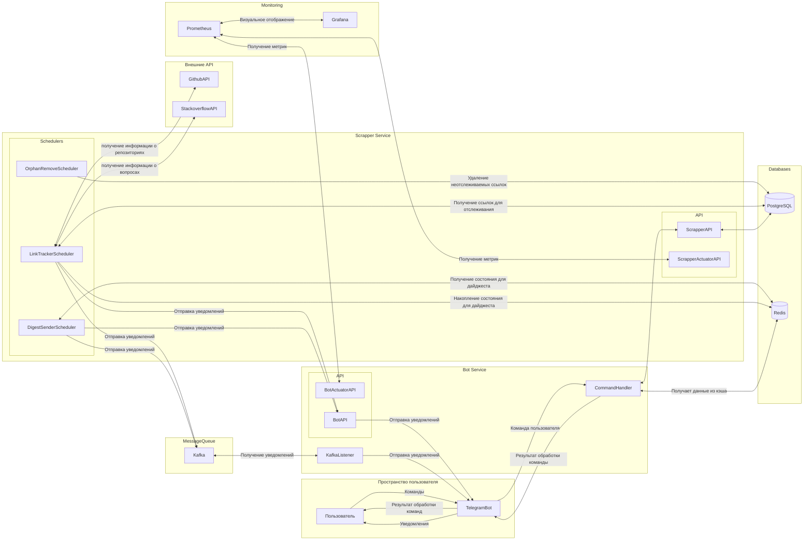

Архитектура проекта LinkTracker
1. Bot Service
    * Регистрация аккаунта в системе
    * Получение списка отслеживаемых ссылок
    * Получение списка доступных команд
    * Управление подписками на ссылки
    * Настройка режима отправки уведомлений
    * Отправка уведомлений по отслеживаемым ссылкам
2. Scraper Service
    * Создание учетных записей пользователей, отслеживаемых ссылок, фильтров и тэгов к ним
    * Периодическая проверка ссылок на наличие изменений путем обращения к API Github и Stackoverflow
    * Отправка изменений по отслеживаемым ссылкам в Bot Service с помощью HTTP или Kafka
    * Получение информации об учетной записи пользователя с его настройками
    * Получение доступных режимов отправки уведомлений
3. PostgreSQL Database
    * Хранение информации об учетных записях пользователей и их настроек
    * Хранение отслеживаемых ссылок, тэгов и фильтров к ним
4. Apache Kafka
    * Отправка уведомлений по отслеживаемым ссылкам из Scrapper Service в Bot Service
5. Redis
    * Кеширование запросов на получение списка отслеживаемых ссылок
    * Накопление состояния для отправки пользователю уведомления в виде дайджеста
6. Мониторинг
    * Prometheus собирает метрики у Bot Service и Scrapper Service
    * Grafana отображает метрики в виде графиков и дашбордов

