## Инструкция по запуску

### Получение токена для телеграм бота

Для этого нам понадобится [@BotFather](https://t.me/BotFather). Это главный сервис в Telegram, через который происходит регистрация всех пользовательских ботов.

1. **Найдите BotFather**: Откройте Telegram и в строке поиска введите «@BotFather». Выберите бота с синей галочкой — это официальный бот Telegram.

<div style="text-align: center;">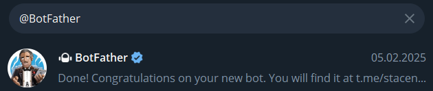</div>

2. **Активируйте BotFather**: Нажмите кнопку «Запустить», чтобы начать диалог с BotFather. Вы увидите список доступных команд.
3. **Создайте своего бота**: Введите команду `/newbot` и следуйте инструкциям BotFather. Вам нужно будет придумать имя и уникальный username для вашего бота.
4. **Получите токен**: После создания бота BotFather выдаст вам уникальный токен — это ключ, который позволит вам управлять вашим ботом. 🔑

### Получение токена для работы с api GitHub

1. Войдите в свой аккаунт на GitHub: 👉 https://github.com
2. Откройте настройки профиля: В правом верхнем углу нажмите на иконку профиля → выберите "Settings".
3. Перейдите в настройки разработчика: В боковом меню слева выберите "Developer settings".
4. Откройте раздел "Personal Access Tokens": В меню слева нажмите "Personal access tokens" → "Tokens (classic)".
5. Нажмите "Generate new token" → "Generate new token (classic)".
6. Введите описание токена.
7. Выберите срок действия токена.
8. Выберите нужные права доступа: (repo будет достаточно).
9. Нажмите "Generate token".

### Получение ключа и токена доступа для работы с api stackoverflow

1. Войдите в учетную запись [Stackoverflow](https://stackoverflow.com/).
2. Перейдите на [Stack Apps](https://stackapps.com/apps/oauth/register)
   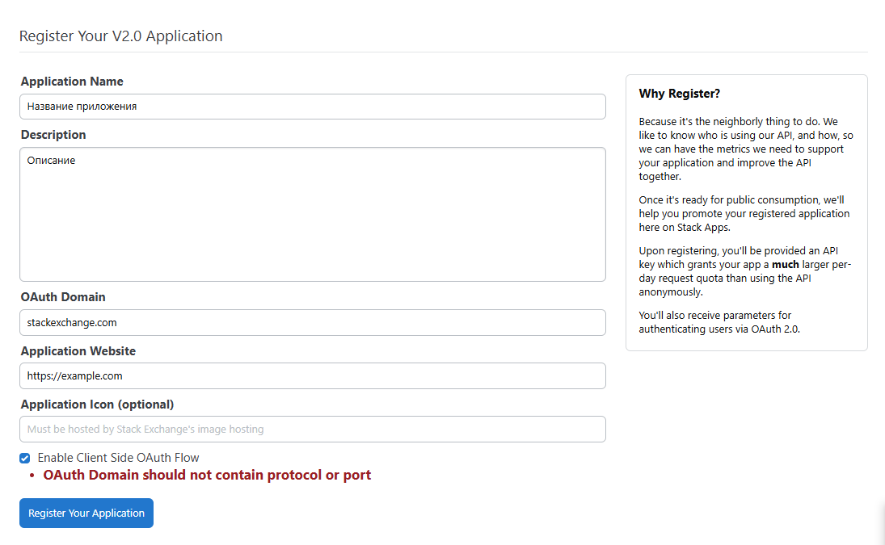
3. Здесь будет указан ключ:
   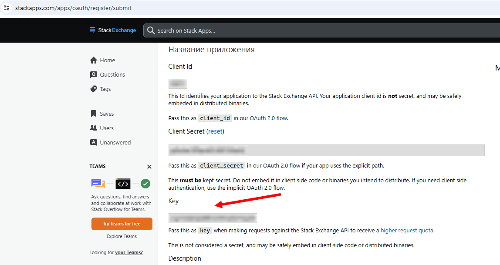
4. Далее необходимо перейти по указанной ссылке, указав свой CLIENT_ID:

```
https://stackoverflow.com/oauth/dialog?client_id=YOUR_CLIENT_ID&scope=read_inbox,no_expiry&redirect_uri=https://stackexchange.com/oauth/login_success
```

5. Далее нажимаем **Approve**
   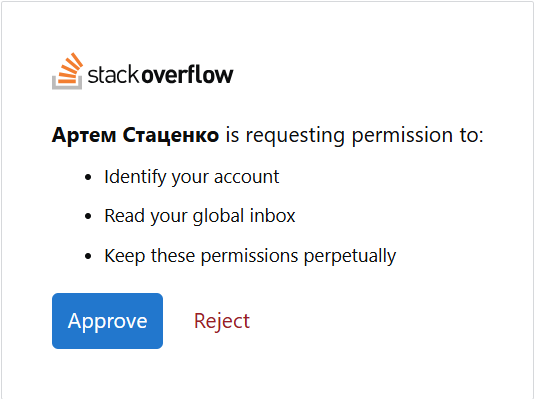

6. Получаем токен доступа из url:
   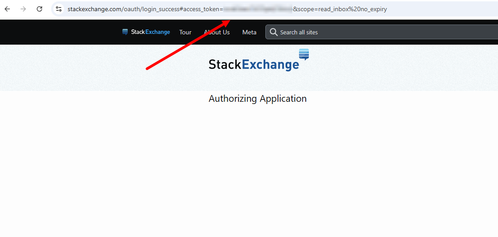

### Настройка переменных окружения

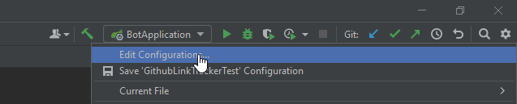
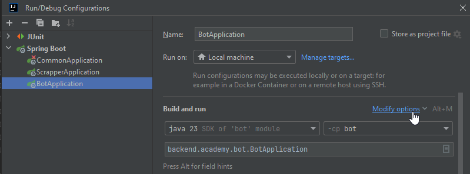
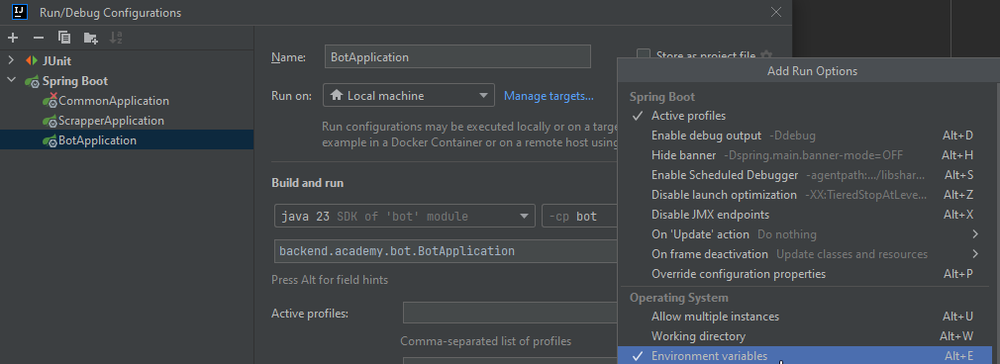

#### Настройка переменных окружения для Bot Service

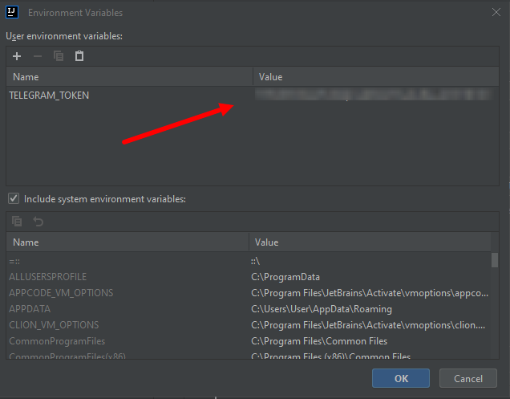

#### Настройка переменных окружения для Scrapper Service

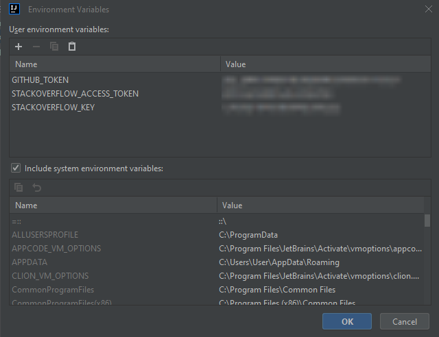

## Инструкция по использованию

Теперь переходим в поиск и указываем @ + название бота, которое было указано в BotFather.

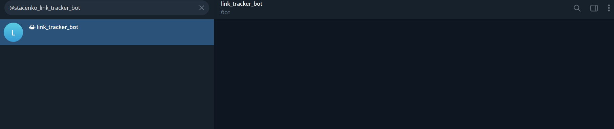
Список доступных команд:
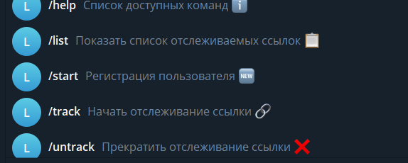
